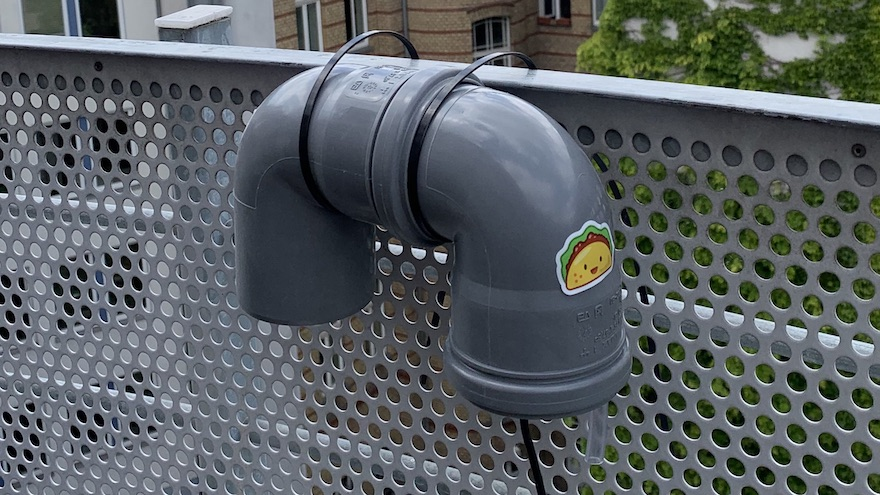

# homebridge-airrohr

[HomeBridge](http://github.com/nfarina/homebridge) module for the DIY [luftdaten.info](https://luftdaten.info) [air particulates](https://en.wikipedia.org/wiki/Particulates) sensor from [OpenData Stuttgart](ttps://github.com/opendata-stuttgart/).

It can be used to see the status of your own sensor in HomeKit. You can also use it to see another sensor if its data is published to data.sensor.community (see [here for more info](http://sensor.community)).

## Features

- See air quality (incl. particulates values for PM10 and PM2.5), temperature and humidity in HomeKit and the Home app
- Get the data from a sensor on your local network
- Get the data from public sensor on `data.sensor.community`
- See history for temperature, etc. using the Elgato Eve app 
- Supported sensors / combinations : 
  - SHT3X (temperature & air quality)
  - DHT22 + BMP280 (temperature & air quality)
  - SDS011 (temperature & air quality)
  - and adding more is simple as long as you get the data as JSON via HTTP

## Setup

First follow the instructions for [HomeBridge](http://github.com/nfarina/homebridge). 

Install `homebridge-airrohr` using `(sudo) npm install -g homebridge-airrohr`.

Configure your AirRohr sensor in the `homebridge` settings file. See [config.sample.json](config.sample.json). All settings except `update_interval_seconds` (defaults to 120 seconds) and `history` (defaults to persisting to memory) are required.

See the documentation of the [fakegato-history](https://github.com/simont77/fakegato-history/blob/master/README.md#history-persistence) module for the list of supported options.

To run this project you have two options

### Option A: The sensor & homebridge in your (home) network

To do this set `json_data` to

`http://feinstaubsensor-<YOUR_SENSOR_ID>.local/data.json`

using the same local network as your sensor. 

*Note:* If you use a HomeKit hub (like a Apple TV or a iPad) you can still access your data from outside your home. See [Apple's documentation for details](https://support.apple.com/en-us/HT207057).

Don't set `public_temperature_json_data` or `public_airquality_json_data` in this scenario.

### Option B: Use the luftdaten.info API

This allows you to add any sensor not only your own. To get the same functionality as above you need to set two IDs/URLs:

- Set `public_temperature_json_data` to the URL where to find the temperature data:  `http://data.sensor.community/airrohr/v1/sensor/<YOUR_TEMPERATURE_SENSOR_ID>/` 

- Set `public_airquality_json_data` to the URL where to find the air particulates (PM10, PM25) data:  `http://data.sensor.community/airrohr/v1/sensor/<YOUR_AIRQUALITY_SENSOR_ID>/` 

Don't set `json_data` in this scenario.

*Note:* If you set `json_data` the `public_…` settings will be ignored.

## Advanced configuration

### Disabling sensors

You can disable several characteristics by setting: 

- `"disable_humidity": true`
- `"disable_temperature": true`
- `"disable_pressure": true`
- `"disable_pm25": true`
- `"disable_pm10": true`

in the config file. Note that if you disable temperature pressure will also not be disanbled.

### Configuring alert limits

The warning levels are calculated at <=40% -> EXCELLENT, <=60% -> GOOD, <=80% -> FAIR, <=100% -> INFERIOR, >100% -> POOR quality. 

The basis for this calculation is the average of the percentage of a daily maximum limit for PM10 and PM2,5. These limits default to 50 µg/m³ and 25 µg/m³ respectivly. However these can be adjusted in the config as well. See the sample config for this.

## Demo

